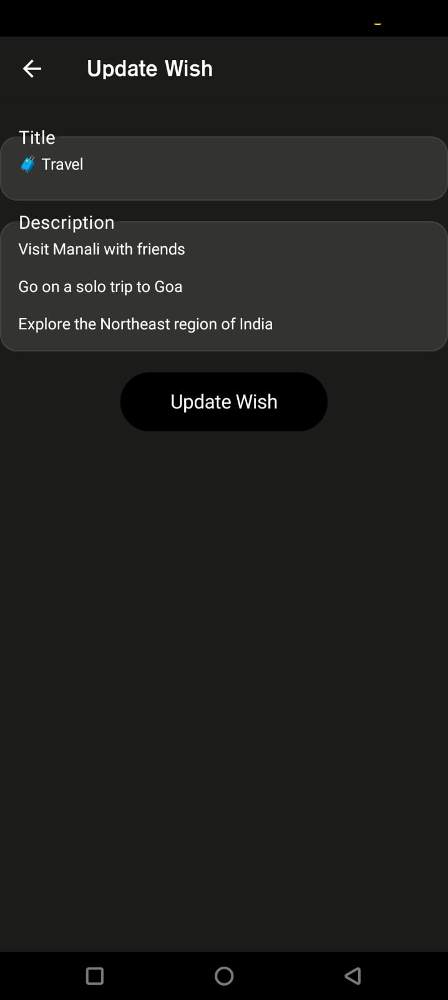
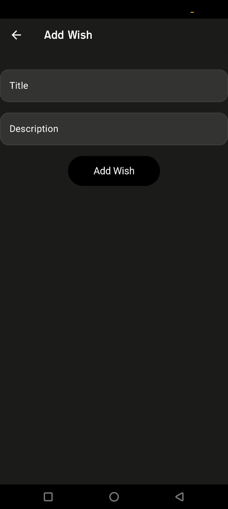

# Wishlist App

A simple Android app that allows users to create, update, delete, and view their wish list items. The app stores wish list items using Room Database, and provides a UI built using Jetpack Compose.

## Features

- **Add New Wish:** Users can add a new item to their wishlist with a title and description.
- **Update Wish:** Users can update existing wish list items.
- **Delete Wish:** Users can delete items from their wish list with swipe-to-dismiss functionality.
- **View All Wishes:** Displays a list of all the items in the wish list.
- **Persistent Storage:** Data is saved using Room Database for offline access.

## Tech Stack

- **Language:** Kotlin
- **Architecture:** MVVM (Model-View-ViewModel)
- **UI Framework:** Jetpack Compose
- **Database:** Room Database
- **Dependency Injection:** Hilt
- **Coroutines:** For asynchronous operations
- **Navigation:** Jetpack Navigation Component

## Installation

1. Clone this repository:
    ```bash
    git clone https://github.com/khitoliya/wish-list-app.git
    ```

2. Open the project in Android Studio.

3. Build and run the app on an emulator or physical device.

## How to Use

1. **Add a new wish:** 
   - Click the "Add" button at the bottom right to add a new item.
   - Enter the title and description for the wish and click "Save".

2. **Update an existing wish:**
   - Click on a wish item to edit its title or description and click "Update".

3. **Delete a wish:**
   - Swipe left on a wish item to reveal the delete option. Click the trash icon to remove the item.

## Project Structure

- `data/`: Contains Room database entities, DAO interfaces, and repository.
- `ui/`: Composables and UI components for displaying the app's interface.
- `viewmodel/`: Contains the ViewModel that connects the UI and repository.
- `MainActivity`: The entry point of the app where the navigation is set up.
- `Navigation`: A centralized place for managing the app's navigation.

## Dependencies

- **Jetpack Compose**: For building the UI.
- **Room Database**: For local data storage.
- **Hilt**: For dependency injection.
- **Coroutines**: For background tasks.
- **Navigation**: For navigating between screens.


## Screenshots

### Home Screen:


### Add/Edit Wish:


### Wish Item:


## Contributing

Feel free to fork this project and submit pull requests. For major changes, please open an issue first to discuss what you would like to change.

## Contact

If you have any questions or suggestions, feel free to contact me at your-email@example.com.

